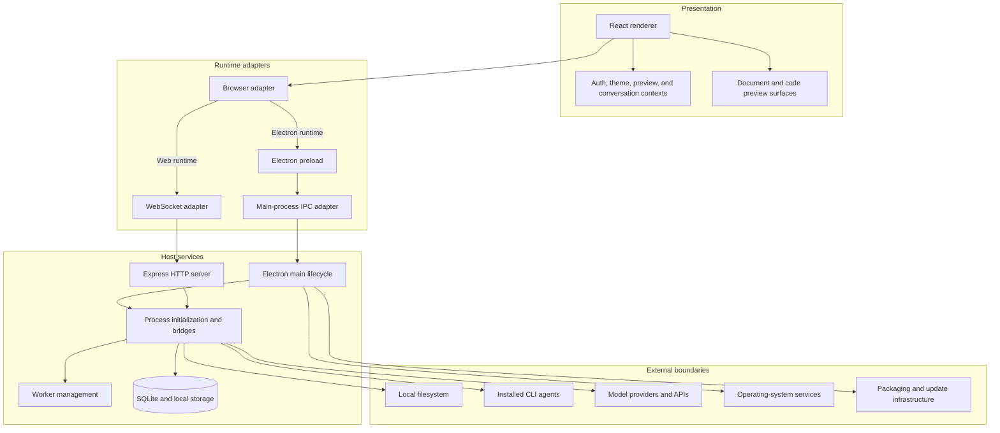
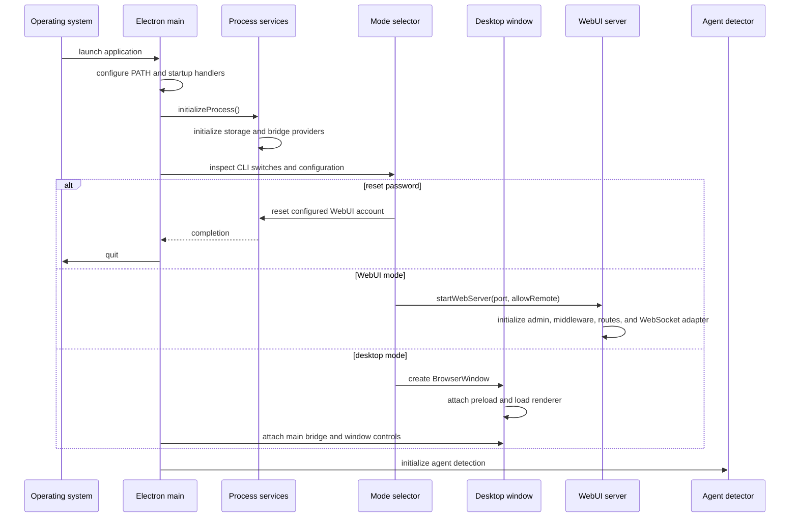
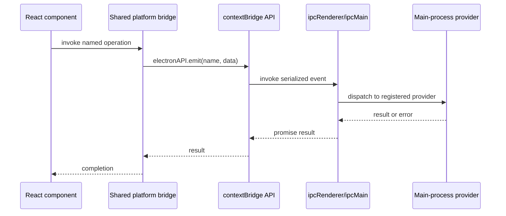
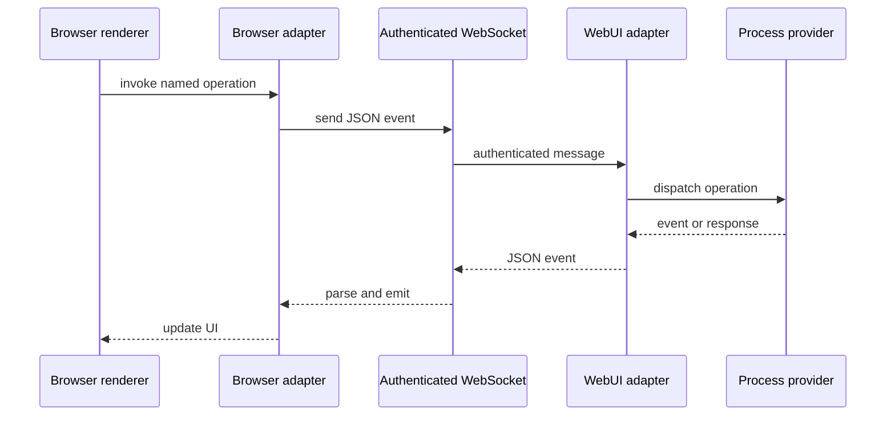
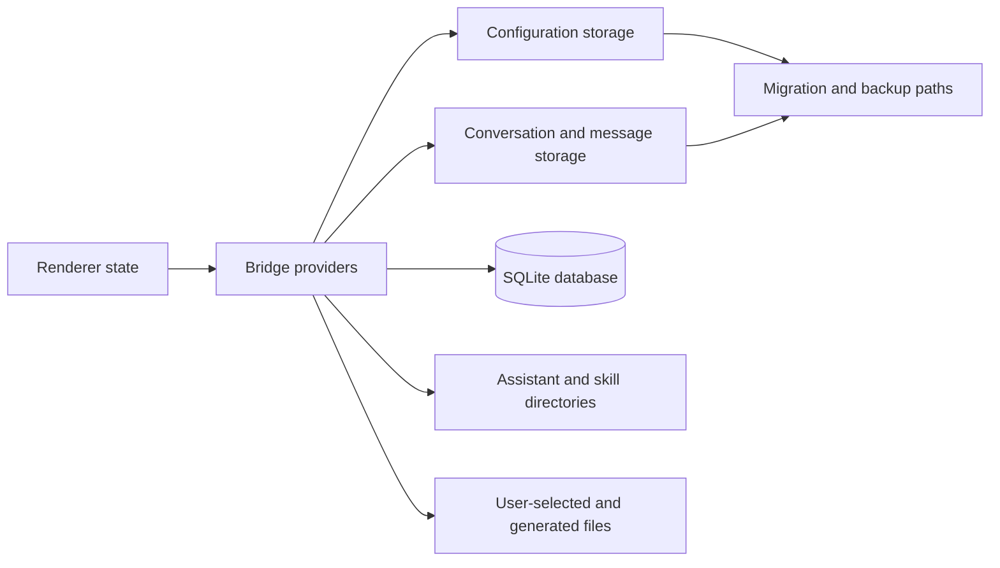
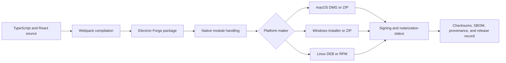

# Architecture

This document describes the architecture observed in the inherited AionUi `1.7.0` repository. It is a review aid, not a claim that every path has been tested or approved for distribution.

## Architectural goals

The inherited system is organized to provide one user interface over several execution contexts:

- an Electron desktop window;
- a browser-based WebUI served by the local application;
- local process services for persistence, agent execution, file operations, previews, and configuration;
- integrations with external model providers and installed command-line agents;
- platform-specific packaging for macOS, Windows, and Linux.

The central design technique is a shared event bridge. Renderer code invokes common application APIs while runtime adapters route those events through Electron IPC or WebSocket transport.

## Component model

## Entry points

| Area | Primary path | Responsibility |
|---|---|---|
| Electron main | `src/index.ts` | Application lifecycle, window creation, mode selection, process initialization, WebUI startup, and worker cleanup |
| Renderer | `src/renderer/index.ts` | React root, localization, UI providers, browser adapter initialization, and application rendering |
| Preload | `src/preload.ts` | Exposes a bounded `electronAPI` object for bridge events and drag/drop path resolution |
| Desktop bridge | `src/adapter/main.ts` | Routes shared platform events through Electron IPC to registered windows |
| Browser bridge | `src/adapter/browser.ts` | Selects Electron IPC when available or WebSocket transport in WebUI mode |
| Process initialization | `src/process/index.ts` | Initializes local storage and process bridge providers |
| Storage | `src/process/initStorage.ts`, `src/process/database/` | Configuration, environment, conversation, message, migration, and database facilities |
| WebUI server | `src/webserver/index.ts` | Express routes, authentication, middleware, static assets, HTTP server, and WebSocket server |
| Packaging | `forge.config.ts`, `scripts/` | Webpack compilation, native module handling, makers, packaging, signing/notarization handoff, and platform artifacts |

## Startup lifecycle

Startup is fail-closed for process initialization: the main process exits when required initialization fails. Review must confirm whether later errors and unhandled exceptions are recorded with enough diagnostic evidence for release support.

## Runtime bridge

### Desktop path

The preload exposes a generic named-event interface rather than individual APIs. That keeps renderer code transport-neutral, but makes provider registration, input validation, authorization, and payload size limits important review points.

### WebUI path

The browser adapter queues messages while disconnected and reconnects with bounded exponential delay. Authentication expiry stops reconnection and redirects to login. Security review must verify server-side authorization for every consequential event rather than relying only on client state.

## Data and persistence

The inherited code contains more than one persistence mechanism:

- user configuration and environment records;
- conversation and message history stored under application-controlled data paths;
- per-conversation history files and migration/backup behavior;
- SQLite-backed users and other database records;
- assistant and skill directories;
- generated files and preview inputs selected by the user or agent.

Documentation and release evidence must avoid the blanket phrase “all data is in SQLite.” The observed code uses SQLite alongside application data files and directories. The final privacy statement should enumerate each category, its location, retention, backup behavior, encryption status, and deletion path.

## Desktop and WebUI modes

The same renderer can run in two host models:

| Concern | Desktop | WebUI |
|---|---|---|
| Transport | Electron IPC via preload | HTTP plus authenticated WebSocket |
| UI host | `BrowserWindow` | External browser |
| Local authority | Electron main process | Local/headless server process |
| Authentication | Host/user session assumptions | Application login, cookies/tokens, admin bootstrap |
| Network exposure | Not required for core UI | Loopback by default; remote mode may bind for network access |
| File access | Desktop dialogs, drag/drop, process providers | Server-side process providers reached through authenticated routes/events |
| Primary threat | Renderer-to-main privilege crossing | Remote client, session, origin, transport, and host exposure |

Remote WebUI is a distinct deployment boundary and must not inherit desktop security assumptions.

## Packaging architecture

The configuration enables Electron fuses that disable Node execution paths and require ASAR integrity/loading controls. It also carries native dependencies that require architecture-specific packaging review. Existing maker configuration and build scripts are implementation assets; they are not proof that artifacts are reproducible, signed, safe, or distributable under the proposed fork identity.

## Trust boundaries

1. **Renderer to privileged host.** Treat rendered content, previews, pasted text, and web-derived data as untrusted before they reach IPC providers.
2. **Browser to WebUI server.** Authenticate and authorize HTTP and WebSocket operations; review cookies, CSRF, CORS, rate limiting, session expiry, and reverse-proxy assumptions.
3. **Agent to filesystem.** Agent-generated paths and commands can affect local files; enforce user intent, workspace boundaries, confirmation, and auditability.
4. **Application to providers.** API keys, prompts, files, and responses may cross external service boundaries; document destination, consent, retention, and redaction.
5. **Application to installed CLI agents.** Detection and invocation of local tools crosses a process-execution boundary; capture executable resolution, arguments, environment, working directory, and cancellation behavior.
6. **Parsers and previews.** Office documents, PDFs, HTML, images, and code are untrusted inputs; isolate active content and constrain resource loading.
7. **Updater and artifacts.** Release metadata, signatures, update feeds, installers, and native binaries are supply-chain boundaries.
8. **Inherited to local code.** Provenance review must distinguish upstream commits from modifications made in this repository.

## Design invariants for local changes

Any later local change should preserve these invariants unless an approved architecture decision explicitly replaces one:

- one transport-neutral application API surface;
- no direct Node access from ordinary renderer code;
- explicit initialization and cleanup of process resources;
- local-first storage with documented external transmissions;
- remote WebUI disabled unless intentionally configured;
- migrations and rollback paths for persistent data;
- platform packaging that records target architecture and native modules;
- upstream attribution and local divergence traceability;
- tests and evidence tied to an immutable commit.

## Known documentation gaps

The following remain unresolved and block a release-quality architecture claim:

- exact upstream commit and divergence report;
- approved mirror/fork/derivative identity;
- authoritative supported-platform matrix;
- complete provider and CLI-agent capability inventory;
- complete storage map and privacy classification;
- WebUI threat model and deployment assumptions;
- updater/signing/notarization ownership;
- verified accessibility architecture and primary workflows;
- clean build, test, artifact, SBOM, checksum, provenance, and rollback evidence.
