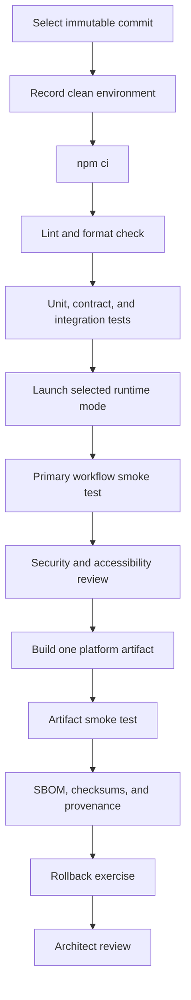

# Developer onboarding

This guide supports review and maintenance of the inherited AionUi `1.7.0` codebase. It does not authorize a public aevespers2 distribution or imply that the baseline currently passes.

## Before changing code

Read these files in order:

1. [`taskchain.md`](../taskchain.md) — active objective, dependency order, acceptance criteria, and non-goals;
2. [`release.md`](../release.md) — blocked gates, candidate evidence, artifacts, and rollback criteria;
3. [`changelog.md`](../changelog.md) — inherited/local distinction and recorded product decisions;
4. [`fork-baseline.md`](fork-baseline.md) — unresolved repository identity and provenance decision;
5. [`architecture.md`](architecture.md) — process boundaries and design invariants;
6. [`security-and-privacy.md`](security-and-privacy.md) — assets and review controls.

Do not begin feature work while P0 remains blocked unless the change is limited to documentation, provenance collection, or non-invasive baseline verification.

## Prerequisites

The inherited repository is an Electron, React, TypeScript, Webpack, Electron Forge, and Jest project with native Node dependencies.

Prepare:

- Git;
- a Node.js and npm version selected and recorded for the baseline;
- a clean clone at an immutable commit;
- platform build prerequisites for the selected operating system;
- enough disk space for Electron, native modules, packaged outputs, caches, and reports;
- no production credentials in the repository, shell history, logs, fixtures, or screenshots.

The accepted Node/npm/OS matrix is not yet established. Record the versions used for every baseline attempt rather than treating a locally successful combination as supported.

## Clean setup

```bash
git clone <approved-repository-url> AionUi
cd AionUi
git checkout <immutable-candidate-commit>

node --version
npm --version
npm ci
```

Use `npm ci` for the release baseline because the inherited repository contains an npm lockfile and the active task chain explicitly requires a clean locked install. Do not regenerate the lockfile during a reproduction run.

Record:

- repository URL;
- commit SHA and branch;
- operating system and architecture;
- Node and npm versions;
- package-lock hash before and after installation;
- command, start/end time, exit code, and complete log;
- any network, proxy, mirror, compiler, SDK, or native-build dependency.

## Development modes

### Desktop

```bash
npm start
```

This starts the Electron development environment. The inherited configuration may open developer tools automatically when the application is not packaged.

### Local WebUI

```bash
npm run webui
```

Use loopback-only access for ordinary development. Record the selected port and confirm that the listener is not unintentionally exposed beyond the host.

### Remote WebUI

```bash
npm run webui:remote
```

Remote mode is security-sensitive. Use only in an isolated test environment with explicit authorization. Review login bootstrap, password rotation, cookies, CSRF, CORS, WebSocket authentication, host firewall, reverse proxy, TLS termination, and log handling before any non-local use.

### Password reset path

```bash
npm run resetpass -- <username>
```

Treat reset output as secret material. Do not copy credentials into issues, CI logs, screenshots, shell transcripts, or retained test evidence.

## Static validation and tests

Run targeted checks during development, then run the complete baseline sequence before review.

```bash
npm run lint
npm run format:check
npm test -- --runInBand
npm run test:contract -- --runInBand
npm run test:integration -- --runInBand
```

Optional diagnostic commands:

```bash
npm run test:coverage -- --runInBand
```

A passing command on one machine is not enough. Retain the exact command, exit code, log, environment, and candidate commit. Record skipped tests, quarantined tests, network dependencies, fixture assumptions, timeouts, and nondeterministic results.

Do not use `npm run format` as a check because it rewrites files. Use `npm run format:check` for evidence and apply formatting separately in a reviewed patch.

## Build and package

Choose one platform for the first approved reproduction rather than attempting to certify all platforms at once.

```bash
npm run package
npm run make
```

The repository also defines distribution helpers such as:

```bash
npm run dist:mac
npm run dist:win
npm run dist:linux
```

Build output is not release-ready until the selected path records:

- source commit and clean working-tree state;
- target OS and architecture;
- native module rebuild/prebuild behavior;
- exact build command and environment variables;
- signing and notarization status;
- installer/package identity and version;
- smoke-test result;
- SBOM and dependency report;
- SHA-256 checksums;
- provenance manifest and generation command;
- rollback or uninstall procedure.

Never upload an inherited or locally generated binary under the aevespers2 identity before the P0 fork/distribution decision is approved.

## Recommended baseline sequence



A failed step stops the candidate unless the failure is classified, reproduced, repaired by a bounded patch, and the sequence is restarted at the appropriate point.

## Primary workflow smoke test

The exact user workflow requires architectural approval, but a baseline smoke test should minimally record:

1. application starts without destructive migration or unhandled fatal error;
2. a user can configure a test provider or isolated local agent without exposing a real credential;
3. a conversation can be created, persisted, closed, and reopened;
4. a bounded file or preview action can be completed in a temporary workspace;
5. the application can stop cleanly and release workers/resources;
6. stored test data can be identified, exported if supported, and deleted;
7. WebUI mode, when included, requires authentication and respects the intended bind scope.

Use synthetic files and dedicated test credentials. Do not point an unverified agent at personal directories or production repositories.

## Repository map for contributors

| Path | Role |
|---|---|
| `src/index.ts` | Electron lifecycle and runtime-mode selection |
| `src/renderer/` | React UI, contexts, conversations, previews, localization, and settings |
| `src/preload.ts` | Renderer-to-host API exposure |
| `src/adapter/` | Desktop IPC and browser WebSocket bridge adapters |
| `src/process/` | Storage, database, providers, agent detection, workers, and host operations |
| `src/webserver/` | Authentication, routes, middleware, static delivery, and WebSocket host |
| `config/webpack/` | Main and renderer compilation |
| `forge.config.ts` | Electron Forge packaging, makers, native modules, and fuses |
| `scripts/` | Build/distribution support scripts |
| `tests/` | Unit, contract, integration, and fixtures |
| `resources/`, `public/` | Application branding and renderer assets |
| `docs/` | Fork-specific architecture, onboarding, security, and release documentation |

This map is descriptive and should be verified against the candidate commit before use in a release report.

## Patch discipline

Every patch should state:

- the approved task and user outcome;
- inherited behavior being preserved or intentionally changed;
- files and boundaries touched;
- expected data or configuration migration;
- security and accessibility impact;
- targeted and full checks;
- rollback method;
- residual risks and follow-up work.

Prefer small commits with one purpose. Do not mix lockfile updates, formatting sweeps, generated assets, rebranding, provider additions, and security changes into a documentation or baseline-verification patch.

## Branch and pull-request workflow

```bash
git switch -c <type>/<bounded-purpose>
# make and verify the smallest patch
git status --short
git diff --check
git diff --stat
git commit -m "<type>: <bounded outcome>"
git push -u origin <branch>
```

A pull request should include:

- inherited baseline and local parent commit;
- scope and non-goals;
- architecture/security/privacy implications;
- commands and evidence;
- screenshots only when they contain no secrets or personal data;
- migration and rollback;
- release-gate impact without overstating completion.

## Documentation changes

Documentation must remain synchronized with implementation and planning files:

- update architecture when a process, adapter, trust boundary, persistence mechanism, or deployment mode changes;
- update onboarding when prerequisites or commands change;
- update security/privacy when data flow, credentials, remote access, parser behavior, or external providers change;
- update `changelog.md` for notable documentation or architecture changes;
- update `release.md` only when evidence changes a gate status;
- update `taskchain.md` only through the Architect-controlled workflow.

## Stop conditions

Stop and request architectural clarification when:

- the change assumes mirror, fork, derivative, or product ownership that has not been approved;
- upstream and local history cannot be separated;
- a public name, release namespace, update channel, signing identity, or distribution target is required;
- a test requires real user data or production credentials;
- remote access cannot be constrained to the approved environment;
- a migration or rollback path is unknown;
- failures appear unrelated and would widen the task;
- documentation would need to claim support or security that has not been verified.
