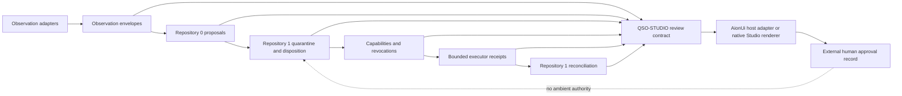
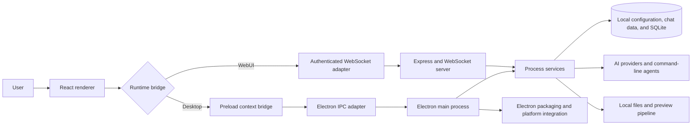

# AionUi

AionUi is an inherited Electron application that presents command-line AI agents, model providers, local files, document previews, and WebUI access through a graphical workspace. This repository currently tracks an AionUi `1.7.0` codebase and is being evaluated as a possible mirror, maintained fork, or independently distributed derivative.

Within A.L.I.S.T.A.I.R.E., AionUi is also a candidate **human-facing workspace shell** for bounded evidence review. It may eventually host a QSO-STUDIO-compatible adapter that displays portable device-trust observations, Repository `0` proposals, Repository `1` dispositions, capabilities, receipts, corrections, revocations, and recovery checkpoints. Display remains non-authoritative; static Pages remains public, read-only, and credential-free.

> **Release status: blocked.** No aevespers2 binary, update channel, privileged adapter, or cross-platform support claim is approved until the fork identity, exact upstream baseline, naming, platform scope, distribution channel, verification evidence, review-contract ownership, and rollback plan are accepted.

## Static portfolio console

[Open the AionUi Portfolio Console](console/)

The console is a browser-safe GitHub Pages demonstration surface. It provides AionUi-style navigation, public repository metadata, portfolio roles, architectural boundaries, and future adapter seams. It does **not** run the Electron main process, WebSocket/Express backend, local files, SQLite, command-line agents, MCP processes, credentials, model providers, device inventories, repository writes, approvals, releases, or deployments.

## Current objectives

The active P0 objective remains provenance and product identity:

1. identify the exact upstream source and inherited commit history;
2. approve whether this repository is a mirror, maintained fork, or derivative;
3. distinguish inherited work from local work;
4. reproduce one supported-platform baseline from a clean environment;
5. retain install, test, security, accessibility, artifact, provenance, and rollback evidence.

A parallel documentation objective defines AionUi's bounded portfolio role:

1. preserve static Pages as public and non-privileged;
2. keep observations, interpretations, proposals, capabilities, receipts, dispositions, and annotations independently identified;
3. share one neutral review/display contract with QSO-STUDIO rather than creating competing approval semantics;
4. treat AionUi as an optional host shell rather than the review-contract or canonical-state authority;
5. bind device, workspace, repository, commit, platform profile, policy profile, and executor identities independently;
6. keep static Pages, desktop, local WebUI, remote WebUI, and packaging as separate trust and release profiles;
7. fail closed for stale, replayed, unsupported, private, revoked, partial, or unverifiable state.

New AI-provider features, rebranding, public binaries, privileged portable-trust adapters, and broad cross-platform claims remain outside the approved scope until the applicable gates are complete.

## Documentation

| Guide | Purpose |
|---|---|
| [Portfolio console](console/) | Static AionUi-style shell wired to public repository metadata and bounded future integration points |
| [Architecture](architecture.md) | Runtime processes, adapters, data flows, storage, WebUI, packaging, and trust boundaries |
| [Runtime-mode topology](runtime-mode-topology.md) | Separate static Pages, Electron desktop, local WebUI, remote WebUI, and packaging allowlists, evidence, and recovery boundaries |
| [Portable trust review profile](portable-trust-review-profile.md) | Candidate read-only display role for device observations, proposals, dispositions, capabilities, receipts, corrections, revocations, and recovery |
| [ADR-0001: host shell and review contract](decisions/0001-host-shell-and-review-contract-boundary.md) | Candidate agreement that QSO-STUDIO owns neutral review semantics while AionUi remains an optional non-authoritative host shell |
| [Obstruction and gluing analysis](obstruction-and-gluing.md) | Cross-repository incompatibilities, pairwise maps, triple-overlap witnesses, and fail-closed fixtures |
| [Developer onboarding](development.md) | Clean setup, commands, verification workflow, contribution discipline, and evidence capture |
| [Security and privacy](security-and-privacy.md) | Assets, boundaries, inherited risk areas, review checklist, and release-blocking controls |
| [Fork baseline decision](fork-baseline.md) | P0 decision record, approval matrix, provenance requirements, and consequences of each repository identity |
| [Task chain](../taskchain.md) | Architect-controlled execution order and acceptance criteria |
| [Punch list](../punchlist.md) | Evidence-oriented work items, gluing fixtures, security review, recovery, and stop conditions |
| [Release plan](../release.md) | Candidate scope, release gates, artifact requirements, and rollback criteria |
| [Changelog](../changelog.md) | Product, architecture, documentation, release, and deployment history |

## Portfolio review boundary

AionUi may render and annotate these records only through an approved adapter. It does not become an observation producer, review-contract owner, capability issuer, executor, canonical-state owner, release authority, or payment authority.

## Observed runtime shape

The desktop and WebUI surfaces share a bridge abstraction, but they cross different security boundaries. Desktop messages traverse the preload/IPC path; browser messages traverse authenticated HTTP and WebSocket endpoints. Both ultimately reach process services that may access local data, files, external model APIs, or installed command-line agents.

## Supported operating modes in the inherited code

| Mode | Entry point | Boundary requiring review |
|---|---|---|
| Desktop | `npm start` | Electron renderer, preload bridge, main process, native modules, filesystem access |
| Local WebUI | `npm run webui` | Local HTTP/WebSocket server, login/session handling, browser bridge |
| Remote WebUI | `npm run webui:remote` | Network exposure, authentication, CORS, cookies, TLS/reverse proxy assumptions, host firewall |
| Static Pages console | GitHub Pages `docs/console/` | Public metadata only; no privileged runtime authority |
| Packaging | `npm run package`, `npm run make`, or platform distribution scripts | Native dependency rebuilds, code signing, notarization, installer identity, checksums, updater behavior |

These modes are inherited capabilities or bounded documentation demonstrations, not verified support commitments from this fork. Each mode requires a distinct data and adapter allowlist; static Pages cannot inherit desktop or WebUI authority, and local WebUI acceptance cannot imply remote WebUI acceptance.

## Repository guardrails

- Preserve upstream copyright, license, notices, commit lineage, and contributor attribution.
- Do not describe inherited AionUi `1.7.0` implementation as newly created aevespers2 work.
- Use the package lock and exact tool versions for baseline reproduction.
- Prefer one verified platform over unverified cross-platform claims.
- Treat API keys, session tokens, local conversation data, filesystem access, remote WebUI, updates, generated artifacts, device records, and canonical-state views as security-sensitive.
- Keep patches bounded, reviewable, reversible, and tied to commands and evidence.
- Keep the Pages console read-only, public-data-only, and credential-free.
- Do not treat display, selection, annotation, export, delivery, authentication, or execution success as canonical approval.
- Do not allow an inherited process, provider, agent, or filesystem bridge to become ambient authority for a review adapter.
- Stop when the requested change depends on an unresolved fork identity, review-contract owner, capability authority, runtime topology, or distribution decision.

## Baseline release gates

A candidate remains blocked until all of the following are evidenced at one immutable commit:

- approved repository identity and product name;
- exact upstream baseline and divergence report;
- clean dependency installation;
- lint, format, unit, contract, integration, and primary-workflow smoke results;
- one reproducible platform build or package;
- Electron, WebUI, credential, storage, network, parser, updater, dependency, secret, and workflow review;
- keyboard, focus, label, contrast, scaling, and error-state accessibility review;
- neutral review/display contract and QSO-STUDIO compatibility decision for any portable-trust adapter;
- accepted mode-specific data, adapter, credential, network, storage, incident, and recovery profiles;
- privacy, correction, revocation, emergency-stop, cache invalidation, and recovery fixtures;
- SBOM, signing/notarization status, artifact checksums, provenance manifest, and rollback procedure.

## Documentation status

This site documents the observed inherited architecture and the controls required to evaluate it. The static console is a safe demonstration and integration scaffold; it does **not** approve a fork identity, certify security, promise support for a platform, authorize backend connections, activate portable-trust review, grant approval authority, or authorize distribution.
