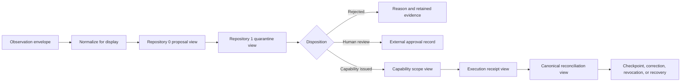

# Portable Trust Review Profile

## Purpose

AionUi is a candidate human-facing review surface for A.L.I.S.T.A.I.R.E.'s portable device-trust foundation. In this role, it may present device observations, Repository `0` proposals, Repository `1` quarantine decisions, narrowly scoped capabilities, execution receipts, revocations, corrections, and recovery checkpoints without becoming the source of those records or the authority that approves them.

The static GitHub Pages console remains public, read-only, credential-free, and limited to non-sensitive portfolio metadata. Any future desktop or authenticated WebUI integration requires a separately approved adapter and policy gateway.

## Role boundary

| Concern | Canonical owner | AionUi responsibility |
|---|---|---|
| Device observation | JusticeForMe, PhantomBlock, or another approved adapter | Render normalized observations and collection limitations |
| Proposal creation | Repository `0` | Display proposal scope, expected state, evidence, rollback, and unresolved findings |
| Quarantine and canonical disposition | Repository `1` or approved successor | Present decision state and provenance without treating display as approval |
| Capability issuance and revocation | Repository `1` or approved successor | Display scope, expiry, issuer, executor, revoker, and status |
| Bounded execution | Approved executor | Show requested and observed effects; never execute from static Pages |
| Human annotation | AionUi or QSO-STUDIO review record | Capture non-authoritative comments and recommendations |
| Release, deployment, payment, or credential approval | Named human authority | Link to external approval evidence; never infer approval from UI interaction |

## Candidate review flow

Every transition must retain distinct record identifiers. A source observation, interpretation, proposal, capability, execution receipt, delivery receipt, canonical disposition, annotation, and recovery checkpoint must not collapse into one generic item.

## Display record requirements

A reviewable record should carry, where applicable:

- record type, schema/profile version, namespace, and stable identifier;
- subject device, workspace, repository, or evidence identity;
- producer identity, source commit, tool version, and collection method;
- creation time, observed time, clock uncertainty, freshness, and replay status;
- privacy classification, redaction state, retention policy, and access boundary;
- collection completeness and per-check status: `PASS`, `FAIL`, `UNKNOWN`, `UNSUPPORTED`, `NOT_RUN`, or `ERROR`;
- source and artifact hashes plus transformation lineage;
- proposal pre-state, requested action, expected post-state, limitations, and rollback plan;
- capability issuer, scope, executor, expiry, revocation, and human-approval requirements;
- execution result, partial-failure state, resulting-state evidence, and reconciliation status;
- correction, revocation, freeze, incident, emergency-stop, and recovery references.

Missing required fields must be visible. The interface must not manufacture a green or compliant state from absent evidence.

## Interface invariants

1. **Display is not authority.** Rendering, selecting, acknowledging, annotating, or exporting a record does not approve it.
2. **Public mode is non-sensitive.** GitHub Pages must not load private inventories, credentials, device identifiers, local paths, tokens, or privileged API endpoints.
3. **Mode is explicit.** Static Pages, desktop, local WebUI, and remote WebUI must display their trust mode and available authority prominently.
4. **Unknown remains unknown.** Unsupported, incomplete, stale, unverifiable, or redacted conditions cannot be presented as compliant.
5. **Record identity is preserved.** Every derived view links back to its immutable source and transformation lineage.
6. **Corrections remain additive.** New corrections or revocations do not erase the original evidence.
7. **Capability scope is visible.** Device, workspace, command/action class, path, network destination, expiry, and executor boundaries are shown before any privileged operation.
8. **Approval is external and exact.** Consequential approval references an immutable record, exact commit or artifact, named authority, and time-bounded scope.
9. **Revocation propagates.** Revoked, superseded, frozen, or recovered records are clearly marked across lists, detail views, exports, and caches.
10. **No optimistic reconciliation.** Successful execution does not become canonical until Repository `1` or its approved successor accepts the resulting-state evidence.

## AionUi and QSO-STUDIO overlap

AionUi and QSO-STUDIO are both candidate human review surfaces. Their responsibilities must not silently diverge.

The lowest-coupling candidate is:

- **QSO-STUDIO:** domain-neutral evidence inspection, comparison, annotation, and proposal export;
- **AionUi:** desktop/WebUI workspace shell that may host an approved QSO-STUDIO-compatible review adapter and broader local agent/provider workflows.

AionUi should consume the same versioned review-record and display contracts rather than defining a second incompatible approval, annotation, or evidence model.

## Required gluing fixtures

### Pairwise fixtures

- observation envelope → AionUi normalized view;
- Repository `0` proposal → proposal review view;
- Repository `1` disposition → canonical-state view;
- capability → scope and expiry view;
- execution receipt → resulting-state and partial-failure view;
- correction/revocation → cache and export invalidation;
- QSO-STUDIO review record → AionUi-compatible rendering.

### Triple-overlap fixtures

- observation adapter → Repository `0` → AionUi;
- Repository `0` → Repository `1` → AionUi;
- Repository `1` → executor → AionUi;
- Seeker/Digitalis/Bridge → Repository `1` → AionUi;
- QSO-STUDIO → AionUi → external approval authority;
- incident authority → Repository `1` → AionUi cache and session state.

### Negative fixtures

The interface must fail closed or visibly degrade for:

- wrong-device, wrong-workspace, or wrong-repository records;
- stale, replayed, unsupported-version, or digest-mismatched records;
- privacy downgrade or forbidden public-mode data;
- missing collection completion or transformation lineage;
- broadened, expired, revoked, or executor-mismatched capabilities;
- partial execution presented as success;
- revoked evidence retained in local cache;
- UI annotation presented as canonical approval;
- static Pages attempting privileged access.

## Recovery and rollback

AionUi state is not the canonical recovery source. On incident or reinstall:

1. freeze privileged adapters and remote WebUI access;
2. preserve local logs and review exports where policy permits;
3. revoke or rotate affected sessions and credentials externally;
4. reconstruct canonical state from Repository `1` and immutable evidence stores;
5. invalidate cached records and reload corrections, revocations, and checkpoints;
6. verify the selected device, workspace, repository, and profile versions;
7. restore adapters from least authority to greatest authority;
8. require explicit approval before re-enabling privileged actions.

## Scope status

This profile is documentation-only. It does not add an adapter, backend, credential, approval workflow, device inventory, remediation command, repository write, release, deployment, payment, or canonical-state capability.