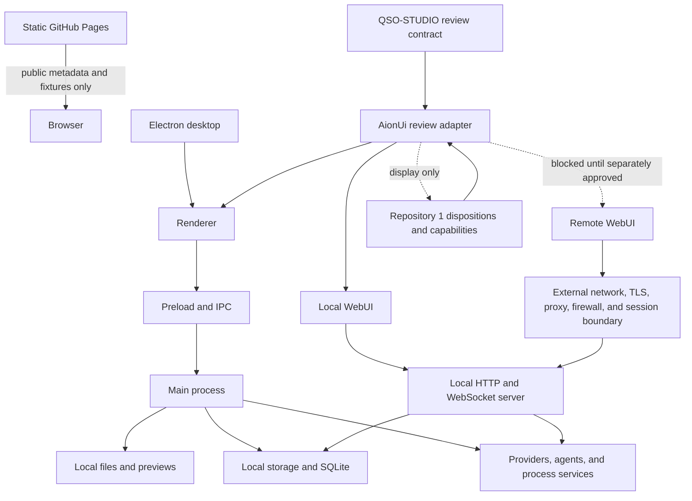

# Runtime-Mode Topology

## Purpose

AionUi contains several inherited execution surfaces that share visual concepts but cross different trust boundaries. This document prevents static Pages, Electron desktop, local WebUI, remote WebUI, and packaging workflows from being treated as one security or authority profile.

A mode is eligible only when its data, adapters, credentials, network exposure, storage, incident controls, evidence, and rollback path are explicit. A capability accepted in one mode does not transfer automatically to another.

## Topology overview

## Mode matrix

| Mode | Intended use | Allowed data | Allowed adapters | Credentials | Network | Persistent state | Release evidence required | Current status |
|---|---|---|---|---|---|---|---|---|
| Static Pages | Public documentation, portfolio navigation, non-sensitive examples | Public repository metadata, documentation, synthetic or redacted fixtures | Public unauthenticated reads only | None | Browser access to approved public origins | Browser cache and session-only demo state | Publication-safety, link, accessibility, responsive, and source-integrity evidence | Documentation candidate |
| Electron desktop | Local workspace and potential review-contract host | Explicitly selected local records and approved private review data | Versioned local adapters admitted per profile | OS-backed or separately reviewed stores only | Deny by default; explicit provider and update destinations | Local files, application stores, and SQLite under documented retention rules | Clean install, tests, platform build, Electron security, credential, filesystem, updater, signing, SBOM, and rollback evidence | Inherited; not accepted |
| Local WebUI | Browser access to a service bound to the local device | Same profile as the approved local service, with session-bound redaction | Explicit local HTTP/WebSocket adapters | Reviewed local session and credential design | Loopback or explicitly approved local interface only | Server-side local state plus browser session/cache | Server authentication, session, CORS, cookie, origin, rate, logging, local firewall, and recovery evidence | Inherited; not accepted |
| Remote WebUI | Network-accessible workspace | Only records approved for the remote deployment profile | Separately admitted remote adapters through a policy gateway | Rotatable service/session credentials with independent revocation | Explicit TLS, proxy, origin, firewall, rate, monitoring, and incident topology | Remote service state and client cache under approved jurisdiction and retention policy | Threat model, deployment design, authentication, session revocation, privacy, audit, penetration, incident, disaster-recovery, and rollback evidence | Blocked |
| Packaging and update | Build, sign, distribute, and update an application | Source, dependencies, build metadata, artifacts, SBOM, signatures | Build and distribution systems only | Signing/notarization/update credentials under named custody | Approved dependency and distribution endpoints | Build cache, artifacts, provenance, update metadata | Reproducible build, checksums, signatures, SBOM, provenance, staged rollout, update rollback, and support ownership | Blocked |

## Static Pages allowlist

Static Pages may include:

- public repository names, descriptions, links, documented roles, and non-sensitive status;
- project overviews, architecture diagrams, onboarding, governance, and release boundaries;
- synthetic or aggressively redacted examples that cannot identify a device, person, account, workspace, or private repository;
- disabled UI controls used only to explain future integration seams;
- public documentation links and unauthenticated public API reads explicitly permitted by the publication profile.

Static Pages must reject:

- device inventories, hardware identifiers, Bluetooth pairings, network routes, hotspot state, local accounts, installed packages, filesystem paths, prompts, conversations, private repository metadata, or evidence from a real device;
- API keys, access tokens, cookies, session identifiers, signing material, recovery secrets, or authority-bearing records;
- authenticated gateways, local services, filesystem APIs, command execution, provider calls, repository writes, approvals, capabilities, payments, releases, deployments, or remote administration;
- dynamic inference that a desktop or WebUI feature is safe merely because the same component name appears in public documentation.

## Desktop allowlist candidate

An accepted desktop profile may allow only adapters that declare:

- adapter identity, version, owner, and support status;
- exact record classes and subject namespaces consumed;
- filesystem paths or resources accessible;
- provider, process, network, and credential requirements;
- privacy classification and retention behavior;
- transformation, redaction, export, correction, and revocation semantics;
- capability class, if any, and proof that display paths remain non-authoritative;
- timeout, rate, resource, offline, failure, recovery, and rollback behavior;
- deterministic positive, negative, stale, replay, partial, wrong-subject, and revoked-state fixtures.

Ambient access inherited from the Electron main process is not an adapter grant.

## Local WebUI allowlist candidate

A local WebUI profile additionally requires:

- explicit bind address and port;
- proof that remote interfaces are disabled unless separately approved;
- authentication and session-expiry behavior;
- cookie, CSRF, CORS, origin, WebSocket, and browser-storage rules;
- local firewall expectations and conflict handling;
- log classification and redaction;
- independent session revocation and emergency disable;
- proof that browser display state cannot mint or broaden capabilities.

`localhost` is a network boundary, not a substitute for authentication or origin control.

## Remote WebUI block

Remote WebUI remains blocked until an approved deployment architecture defines:

1. operator and service identity;
2. TLS termination and certificate ownership;
3. reverse-proxy and trusted-header behavior;
4. authentication, multi-factor policy, session binding, and revocation;
5. origin, CORS, CSRF, WebSocket, cookie, and browser-storage rules;
6. network segmentation, firewall, rate limits, abuse controls, monitoring, and alerting;
7. record classification, jurisdiction, retention, deletion, export, and incident notification;
8. adapter and endpoint allowlists;
9. secret custody, rotation, recovery, and emergency stop;
10. backups, disaster recovery, rollback, support, and decommissioning;
11. application and adapter security tests against an immutable release candidate;
12. explicit human approval for the exact environment and version.

The existence of inherited `webui:remote` commands is not evidence that remote deployment is safe or supported.

## Cross-mode invariants

Every mode must preserve:

- record type, subject, source, profile, version, and hash identity;
- observation, interpretation, proposal, capability, execution, disposition, annotation, and checkpoint separation;
- visible `PASS`, `FAIL`, `UNKNOWN`, and partial-state semantics where applicable;
- freshness, replay, correction, revocation, supersession, and cache state;
- privacy classification and transformation lineage;
- explicit non-authority of display, selection, annotation, export, delivery, and execution success;
- independent emergency stop and recovery;
- exact build, configuration, adapter, and source identity in evidence.

## Mode transition rules

Moving a workflow between modes is a migration, not a configuration toggle. A transition requires:

1. source and target mode profiles;
2. data-classification and adapter-difference analysis;
3. credential and network-boundary review;
4. storage, cache, correction, revocation, and retention migration;
5. compatibility and negative fixtures;
6. incident and rollback plan;
7. exact candidate evidence and approval.

No static Pages, desktop, or local-WebUI acceptance implies remote-WebUI acceptance.

## Recovery order

When a mode is suspected of compromise:

1. revoke sessions and adapter capabilities independently of the affected mode;
2. disable external exposure and privileged adapters;
3. preserve logs, records, caches, exports, configuration, and artifact identity;
4. reconstruct authoritative disposition and recovery state from Repository `1` and immutable evidence;
5. restore static read-only documentation first if needed;
6. restore local review using the least privileged accepted adapter;
7. restore provider, process, filesystem, repository, payment, or remote functionality only after separate verification and approval.

## Scope status

This topology is documentation and release-governance guidance. It does not activate an adapter, backend, provider, agent, credential, filesystem path, local service, remote endpoint, approval, capability, release, deployment, payment, or canonical-state mutation.
