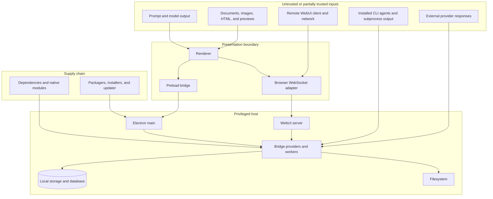

# Security and privacy

This document identifies security and privacy boundaries in the inherited AionUi `1.7.0` codebase. It is a review plan, not a security certification. The release gate remains blocked until the controls below are tested and evidenced at an immutable candidate commit.

## Security objectives

A verified distribution should:

- preserve user control over agent actions, files, credentials, and network exposure;
- keep privileged host operations behind validated and authorized interfaces;
- make external data transmission visible and attributable to a configured provider or integration;
- protect local conversations, configuration, sessions, and credentials from unauthorized access;
- constrain remote WebUI access to an explicitly approved deployment model;
- treat parsed documents, previews, generated HTML, model output, and agent output as untrusted;
- produce reproducible, attributable, integrity-protected release artifacts;
- support safe migration, deletion, rollback, and incident investigation.

## Protected assets

| Asset | Examples | Required handling |
|---|---|---|
| Provider credentials | API keys, OAuth tokens, cloud credentials, local-model endpoints | Never log or commit; redact diagnostics; document storage and deletion |
| WebUI credentials | Admin password, password hashes, cookies, JWT/session material | Strong bootstrap, rotation, expiry, CSRF/session controls, secret-safe logs |
| User content | Conversations, prompts, attachments, generated files, previews | Local inventory, consent for external transmission, retention and deletion |
| Filesystem authority | Selected folders, dragged files, agent workspaces, generated outputs | Workspace boundaries, path validation, confirmation, least privilege, audit |
| Agent execution | Executable path, arguments, environment, working directory, subprocess output | Explicit resolution, bounded commands, cancellation, output limits, provenance |
| Application integrity | Source, native modules, installers, update metadata, signatures | Reproducible builds, SBOM, checksums, signing/notarization, trusted update source |
| User identity and settings | Accounts, preferences, assistants, skills, configuration | Access control, migration safety, backup behavior, complete reset/deletion path |
| Diagnostic evidence | Logs, crash data, screenshots, test reports | Minimize personal data and secrets; retain only what release/support needs |

## Trust-boundary map

## Desktop renderer boundary

The renderer reaches privileged operations through a preload object that exposes generic event emission and subscription. The main adapter dispatches named events to registered providers.

Required review:

- inventory every event/provider and classify read, write, execution, credential, network, update, and administrative authority;
- validate payload schemas and reject unknown names, oversized payloads, unsafe paths, and malformed data;
- authorize operations based on explicit user intent and runtime context;
- avoid returning secrets or unrestricted filesystem details to rendered content;
- verify `contextIsolation`, sandbox, Node integration, navigation, window-open, permission, and webview policies;
- confirm that document/HTML previews cannot call privileged bridge functions unexpectedly;
- rate-limit or serialize consequential operations where reentrancy could corrupt state;
- record safe audit events without storing prompt/file contents unnecessarily.

The inherited Forge configuration enables several Electron fuses, which is useful hardening input. Fuse configuration alone does not establish safe renderer behavior.

## WebUI boundary

WebUI mode adds an Express server, authentication routes, API routes, static content, and WebSocket transport. Remote mode can expose privileged local capabilities to another device.

Required review:

- bind to loopback unless remote access is explicitly enabled;
- document the exact bind address and distinguish display URLs from listener behavior;
- require authentication and authorization for every HTTP route and WebSocket event;
- verify password generation, first-login rotation, password hashing parameters, reset behavior, and account recovery;
- protect cookies/tokens with appropriate `HttpOnly`, `Secure`, `SameSite`, lifetime, rotation, and revocation controls;
- verify CSRF protection for state-changing HTTP operations;
- use explicit CORS allowlists rather than broad origins outside isolated development;
- enforce origin checks and session validation during WebSocket upgrade and throughout the connection;
- rate-limit login, reset, API, and high-cost agent operations;
- use TLS for any traffic beyond loopback, normally through a documented reverse proxy or approved native configuration;
- define trusted-proxy settings before relying on forwarded addresses or secure cookies;
- avoid printing reusable credentials in logs retained by services, terminals, CI, or support bundles;
- verify logout, expiry, reconnect, and authentication-failure behavior;
- test host firewall, NAT, container, headless-server, and public-address assumptions.

Remote WebUI must be assessed as a deployment feature, not merely a UI preference.

## Filesystem and agent authority

AionUi is designed to coordinate AI agents that can work with local files. That capability creates a high-impact boundary even when the application itself runs locally.

Controls to verify:

- explicit workspace selection and a visible current working directory;
- canonical path resolution and prevention of traversal or symlink escape where a boundary is promised;
- confirmation before destructive, bulk, executable, credential-related, or out-of-workspace actions;
- safe defaults for generated file names, overwrite behavior, and conflict handling;
- separation of temporary preview files from user originals;
- bounded subprocess environment and removal of unnecessary inherited secrets;
- executable identity and version capture for detected CLI agents;
- cancellation, timeout, output-size, and child-process cleanup;
- distinguish model suggestions from executed host actions in the UI and logs;
- safe handling of shell metacharacters and argument arrays;
- synthetic test workspaces for verification.

No documentation should promise “local data security” without also explaining when prompts, files, images, or metadata are sent to configured external providers.

## Provider and credential boundary

The inherited package includes integrations for multiple cloud and local model endpoints. A provider inventory should record, for each integration:

| Field | Required documentation |
|---|---|
| Provider identity | Service/product and adapter path |
| Authentication | API key, OAuth, local endpoint, cloud credential chain, or external CLI session |
| Data sent | Prompts, history, files, images, tool results, metadata |
| Destination | Default and configurable endpoints; proxy behavior |
| Retention | Known provider policy or explicit unknown status |
| User control | Enable/disable, model selection, consent, data-scope indication |
| Secret storage | Location, protection, export, rotation, and deletion |
| Logging | Client/server logs and redaction behavior |
| Failure behavior | Retry, fallback, partial transmission, cancellation, and error display |

Provider configuration should not silently broaden agent or tool authority.

## Storage and privacy inventory

The inherited code uses SQLite as well as application-controlled configuration, environment, conversation, message, assistant, skill, migration, and backup paths. Before distribution, produce a table with:

- data category;
- exact default location by platform;
- format and schema/version;
- whether contents are plain, encoded, hashed, or encrypted;
- source and consumers;
- retention and automatic cleanup;
- backup and migration behavior;
- export path;
- user-visible deletion path;
- behavior after uninstall;
- external transmission conditions.

Encoding is not encryption. Password hashing does not protect unrelated local data. Filesystem permissions, OS account boundaries, full-disk encryption assumptions, and backup tools should be documented without overstating application-level protection.

## Parser and preview boundary

AionUi can preview or process office documents, PDFs, spreadsheets, presentations, code, Markdown, HTML, images, and diffs. Treat all such content as hostile during security testing.

Review:

- parser dependency versions and known vulnerabilities;
- decompression bombs, oversized documents, recursive archives, and excessive dimensions;
- external resource loading from HTML, Markdown, SVG, office documents, or stylesheets;
- scripts, event handlers, macros, embedded objects, links, and active content;
- webview navigation, permissions, downloads, popups, and access to preload APIs;
- path disclosure in errors and previews;
- temporary-file permissions and cleanup;
- formula injection when exporting spreadsheets or CSV;
- unsafe Markdown/HTML rendering and sanitization;
- CPU, memory, disk, and worker limits;
- malicious fixtures for every supported format included in the candidate.

## Dependency and supply-chain boundary

The project contains JavaScript dependencies, Electron, native modules, build tools, packaging tools, and platform installers.

Release evidence should include:

- locked dependency installation from a clean environment;
- dependency and license inventory;
- vulnerability scan with triage, not only raw counts;
- secret scan of source and history relevant to the fork;
- review of lifecycle scripts and post-install behavior;
- native binary source and architecture verification;
- CI workflow permissions, third-party actions, and pinning;
- Electron version/support review;
- SBOM tied to the candidate artifact;
- source archive and artifact SHA-256 checksums;
- signing/notarization identity and verification command;
- update-feed ownership, transport integrity, downgrade behavior, and rollback;
- provenance manifest linking source commit, environment, commands, tools, and artifacts.

## Security verification matrix

| Area | Minimum evidence |
|---|---|
| Electron | Effective webPreferences, fuses, navigation/window policy, permission policy, IPC/provider inventory |
| Authentication | Bootstrap, hash settings, login throttling, session/cookie controls, reset, expiry, revocation |
| WebUI | Bind scope, TLS/proxy model, CORS, CSRF, WebSocket origin/auth, remote-access test |
| Files | Workspace boundaries, traversal/symlink tests, overwrite/destructive confirmation, temporary-file cleanup |
| Agents | Executable resolution, arguments, environment, cancellation, cleanup, malicious output tests |
| Providers | Credential storage, endpoint inventory, transmission disclosure, redacted errors/logs |
| Storage | Complete data map, permissions, migration, backup, export, deletion, uninstall behavior |
| Parsers/previews | Adversarial fixture suite, active-content controls, resource limits, external-load behavior |
| Dependencies | Lockfile verification, vulnerability/license report, lifecycle/native module review, SBOM |
| Artifacts | Reproducible selected-platform build, signing status, checksums, provenance, rollback |
| Accessibility | Secure authentication/error flows remain keyboard- and assistive-technology-usable |

## Privacy notice requirements

A release-quality privacy notice should answer, in plain language:

- what the application stores locally;
- what leaves the device and under which configured provider or integration;
- whether remote WebUI exposes the application to a network;
- how credentials are stored and removed;
- how conversations, generated files, logs, assistants, skills, and accounts are deleted;
- what remains after uninstall or migration;
- whether analytics, crash reporting, update checks, or public-IP discovery occur;
- which statements apply to the aevespers2 fork versus upstream AionUi.

Do not copy an upstream privacy statement without verifying that the fork's code, build, endpoints, configuration, and distribution behavior match it.

## Incident and rollback triggers

Withdraw or block a candidate when:

- a credential, token, private prompt, file, or local path is exposed unexpectedly;
- remote WebUI binds beyond the approved scope or accepts unauthorized operations;
- renderer or preview content reaches privileged operations without validated authorization;
- agent execution escapes the intended workspace or cannot be cancelled/cleaned up;
- storage migration loses, corrupts, or silently exposes data;
- an unresolved severe dependency/native/parser issue affects the candidate path;
- signing, update metadata, artifact hashes, or provenance do not verify;
- the release identity or upstream attribution is ambiguous;
- the documented privacy behavior cannot be reproduced.

Preserve logs and artifacts after removing secrets, restore the last verified baseline, revoke exposed credentials, disable affected distribution/update paths, and record the incident and corrective evidence.

## Current status

No security or privacy gate is marked passed by this document. It establishes the review surface and evidence requirements needed by `taskchain.md` P2 and the blocked acceptance gates in `release.md`.
